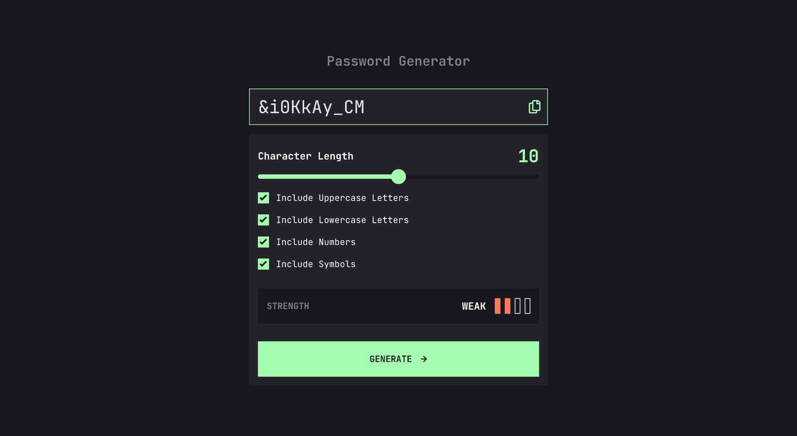

# Frontend Mentor - Password generator app solution

This is a solution to the [Password generator app challenge on Frontend Mentor](https://www.frontendmentor.io/challenges/password-generator-app-Mr8CLycqjh). Frontend Mentor challenges help you improve your coding skills by building realistic projects.

## Table of contents

- [Overview](#overview)
  - [The challenge](#the-challenge)
  - [Screenshot](#screenshot)
  - [Links](#links)
- [My process](#my-process)
  - [Built with](#built-with)
  - [What I learned](#what-i-learned)
  - [Continued development](#continued-development)
  - [Useful resources](#useful-resources)
- [Author](#author)
- [Acknowledgments](#acknowledgments)

## Overview

### The challenge

Users should be able to:

- Generate a password based on the selected inclusion options
- Copy the generated password to the computer's clipboard
- See a strength rating for their generated password
- View the optimal layout for the interface depending on their device's screen size
- See hover and focus states for all interactive elements on the page

### Screenshot



### Links

- Solution URL: [Add solution URL here](https://your-solution-url.com)
- Live Site URL: [Add live site URL here](https://your-live-site-url.com)

## My process

### Built with

- Semantic HTML5 markup
- CSS custom properties
- Flexbox
- CSS Grid
- Mobile-first workflow
- Vanilla JavaScript for functionality

### What I learned

This project helped me get better at working with vanilla JavaScript, especially for creating random passwords and calculating their strength based on entropy. I also learned how to provide real-time feedback to users by updating the UI based on their interactions. For example, the password strength indicator dynamically changes color and text depending on the calculated entropy of the generated password.

I practiced customizing form inputs such as range and checkbox.
input range don't display the same in different browsers so I need to deactivate the browser styles and add custom css rules for webkit browsers and firefox.

To have a cross browser custom progress bar, I used a linear-gradient. It starts at 50% and is updated in JavaScript when the value of the range changes.

```css
input[type="range"] {
  -webkit-appearance: none;
  appearance: none;
  background: $clr-very-dark-gray;
  height: 0.5rem;
  border-radius: 50px;
  background-image: linear-gradient(
    to right,
    $clr-very-dark-gray 0%,
    $clr-neon-green 0%
  );
  background-size: 50% 100%;
  background-repeat: no-repeat;
}
```

This will update the range background color when the input changes. I'm also calling the updateRangeStyle function after the DOM is loaded in case of a page refresh by the user.

```js
range.addEventListener("input", updateRangeStyle);

function updateRangeStyle() {
  const min = range.min;
  const max = range.max;
  const currentValue = range.value;

  range.style.backgroundSize =
    ((currentValue - min) * 100) / (max - min) + "% 100%";
}
```

I learned about the Clipboard APi which allows me to copy the password to the clipboard even if the input type is "password".

I learned about RegExp.prototype.test().  
_The test() method of RegExp instances executes a search with this regular expression for a match between a regular expression and a specified string. Returns true if there is a match; false otherwise._ (MDN)

I used this to measure the entropy of the generated password. This function could be used as well to test a password entered manually by a user.

```js
function calculatePasswordEntropy(password) {
  let characterSetSize = 0;

  const hasLowerCase = /[a-z]/.test(password);
  // other tests...

  if (hasLowerCase) characterSetSize += 26;
  // other conditions...

  // No valid character types found
  if (characterSetSize === 0) return 0;

  // calculate how many bits of information each character in the password contributes
  // based on the size of the character set
  const entropy = Math.log2(characterSetSize) * password.length;

  return entropy;
}
```

I learned how to better organise the code in objects to encapsulate UI elements and constants for example.

I tested different data structure to organise options. For the values I use to calculate the strength and update the color of the scale for example.

```js
const strengthConfig = [
  { color: "#f64a4a", text: "Too Weak!" },
  { color: "#fb7c58", text: "Weak" },
  { color: "#f8cd65", text: "Medium" },
  { color: "#a4ffaf", text: "Strong" },
][strength - 1] || { color: "transparent", text: "" };
```

**Key JavaScript functions:**

- `generateRandomString(length)`: Creates a random password based on the character sets the user selects.
- `calculatePasswordEntropy(password)`: Calculates how strong the password is by looking at the different characters used.
- `evaluatePasswordStrength(entropy)`: Decides the strength of the password (like "Weak" or "Strong") based on its entropy.
- `displayScale()`: Updates the strength indicator to show how strong the password is.
- `updateRange()`: Changes the style of the range slider based on the selected password length.

### Continued development

- Refactor to use a crypto module or the web crypto api

### Useful resources

- [Entropy(Information theory) - Wikipedia](<https://en.wikipedia.org/wiki/Entropy_(information_theory)>) - I used this to learn more about entropy.
- [Clipboard API - MDN](https://developer.mozilla.org/en-US/docs/Web/API/Clipboard_API) - This helped me understand the Clipboard API to be able to copy the password.

## Author

- Website - [Gwenael Magnenat](https://gmagnenat.com)
- Frontend Mentor - [@gmagnenat](https://www.frontendmentor.io/profile/gmagnenat)
- Twitter - [@gmagnenat](https://www.linkedin.com/in/gmagnenat)

## Acknowledgments

Thanks to the Frontend Mentor community for offering great challenges that help us learn by doing real projects. Their support and feedback are really helpful!
